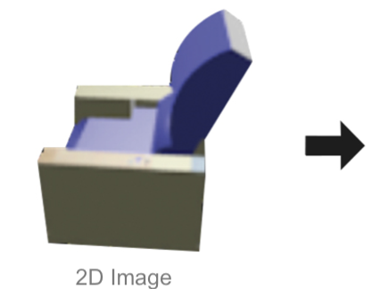
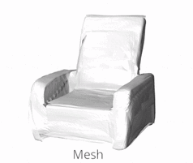

## AtlasNet [[Project Page]](http://imagine.enpc.fr/~groueixt/atlasnet/) [[Paper]](https://arxiv.org/abs/1802.05384) [[Talk]](http://imagine.enpc.fr/~groueixt/atlasnet/atlasnet_slides_spotlight_CVPR.pptx)

**AtlasNet: A Papier-Mâché Approach to Learning 3D Surface Generation** <br>
Thibault Groueix,  Matthew Fisher, Vladimir G. Kim , Bryan C. Russell, Mathieu Aubry  <br>
In [CVPR, 2018](http://cvpr2018.thecvf.com/).

 


### Install

This implementation uses Python 3.6, [Pytorch](http://pytorch.org/), [Pymesh](https://github.com/PyMesh/PyMesh), Cuda 10.1. 
```shell
git clone --recurse-submodules https://github.com/ThibaultGROUEIX/AtlasNet.git
cd AtlasNet 

#Dependencies
conda create -n atlasnet python=3.6
conda activate atlasnet
conda install pytorch torchvision cudatoolkit=10.1 -c pytorch # pytorch
pip install --user --requirement  requirements.txt # pip dependencies
python setup.py --build # build metro distance(optional)
```


### Usage

* **[Demo](./doc/demo.md)** :    ```python train.py --demo```
* **[Training](./doc/training.md)** :  ```python train.py```  *Monitor on  http://localhost:8890/*
* <details><summary> Latest Refacto 12-2019  </summary>
  - [x] Factorize Single View Reconstruction and autoencoder in same class <br>
  - [x] Factorise Square and Sphere template in same class<br>
  - [x] Add latent vector as bias after first layer(30% speedup) <br>
  - [x] Remove last th in decoder <br>
  - [x] Make large .pth tensor with all pointclouds in cache(drop the nasty Chunk_reader) <br>
  - [x] Make-it multi-gpu <br>
  - [x] Add netvision visualization of the results <br>
  - [x] Rewrite main script object-oriented  <br>
  - [x] Check that everything works in latest pytorch version <br>
  - [x] Add more layer by default and flag for the number of layers and hidden neurons <br>
  - [x] Add a flag to generate a mesh directly <br>
  - [x] Add a python setup install <br>
  - [x] Make sure GPU are used at 100% <br>
  - [x] Add f-score in Chamfer + report f-score <br>
  - [x] Get rid of shapenet_v2 data and use v1! <br>
  - [x] Fix path issues no more sys.path.append <br>
  - [x] Preprocess shapenet 55 and add it in dataloader <br>
  - [x] Make minimal dependencies <br>
  </details>

  


### Related projects

*  [Learning Elementary Structures](https://github.com/TheoDEPRELLE/AtlasNetV2)
*  [3D-CODED](https://github.com/ThibaultGROUEIX/3D-CODED)
*  [Cycle Consistent Deformations](https://github.com/ThibaultGROUEIX/CycleConsistentDeformation)
*  [Atlasnet code V2.2](https://github.com/ThibaultGROUEIX/AtlasNet/tree/V2.2) (more linear, script like, may be easier to understand at first)


### Citing this work

```
@inproceedings{groueix2018,
          title={{AtlasNet: A Papier-M\^ach\'e Approach to Learning 3D Surface Generation}},
          author={Groueix, Thibault and Fisher, Matthew and Kim, Vladimir G. and Russell, Bryan and Aubry, Mathieu},
          booktitle={Proceedings IEEE Conf. on Computer Vision and Pattern Recognition (CVPR)},
          year={2018}
        }
```
<p align="center">
  
</p>
