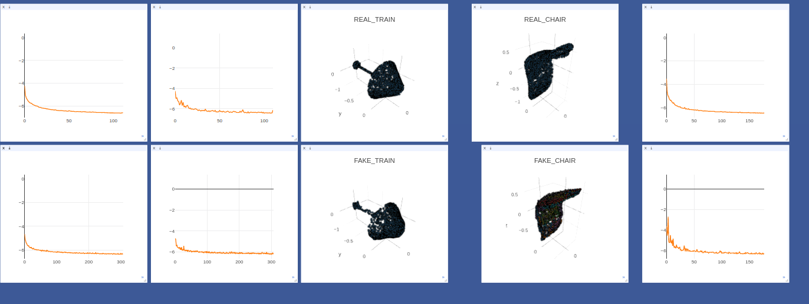

# AtlasNet

This repository contains the source codes for the paper [AtlasNet: A Papier-Mâché Approach to Learning Mesh Synthesis](http://imagine.enpc.fr/~groueixt/atlasnet/). The network is able to synthesize a mesh (point cloud + connectivity) from a low-resolution point cloud, or from an image.
    


## Citing this work

If you find this work useful in your research, please consider citing:

```
@article{groueix2017,
   title={AtlasNet: A Papier-Mâché Approach to Learning 3D Surface Generation},
   author={Goueix, Thibault and Fisher, Matthew and Kim, Vladimir G. and Russel, Bryan C.    and Aubry, Mathieu},
   journal={arXiv preprint arXiv:1802.05384},
   year={2018}
}
```

## Project Page

The project page is available http://imagine.enpc.fr/~groueixt/atlasnet/

## Install

This implementation uses [Pytorch](http://pytorch.org/). Please note that the Chamfer Distance code doesn't work on  [all versions of pytorch](http://pytorch.org/) because of some weird error with the batch norm layers. It has been tested on v1.12, v3 and the latest sources available to date.
### Pytorch compatibility
| [Pytorch](http://pytorch.org/) version | v1.12           | v2  | v3.1  |  0.4.0a0+ea02833 |
| ------------- |:-------------:| -----:|-----:|-----:|
|  | :heavy_check_mark: :+1: :smiley: | :no_entry_sign: :thumbsdown: :disappointed: | :no_entry_sign: :thumbsdown: :disappointed: | :heavy_check_mark: :+1: :smiley: |


```shell
## Download the repository
git clone git@github.com:ThibaultGROUEIX/AtlasNet.git
## Create python env with relevant packages
conda create --name pytorch-atlasnet --file aux/spec-file.txt
source activate pytorch-atlasnet
## Build chamfer distance
cd AtlasNet/nndistance/src
nvcc -c -o nnd_cuda.cu.o nnd_cuda.cu -x cu -Xcompiler -fPIC -arch=sm_52
cd ..
python build.py
python test.py
```

## Data and Trained models

We used the [ShapeNet](https://www.shapenet.org/) dataset for 3D models, and rendered views from [3D-R2N2](https://github.com/chrischoy/3D-R2N2):

* [The point clouds from ShapeNet, with normals](https://mega.nz/#!9LhW2CxT!A9d45cri4q8q10HfukUV_cy7J1lbWTFQtw7DKJlZKKAhttps://mega.nz/#!9LhW2CxT!A9d45cri4q8q10HfukUV_cy7J1lbWTFQtw7DKJlZKKA) go in ``` data/customShapeNet```
* [The corresponding normalized mesh (for the metro distance)](https://mega.nz/#!leAFEK5T!SDrcll-caO4p8ws7zDNKPpjNNWEMcf9AQ-rmR79t_OA) go in ``` data/ShapeNetCorev2Normalized```
* [the rendered views](https://mega.nz/#!4TgzCYTB!ACfHTD9VpUSUYYwI75k-GrSdqMH19jK0-CwBg1wKH08) go in ``` data/ShapeNetRendering```

The trained models and some corresponding results are also available online :

* [The trained_models](https://mega.nz/#!JapgQRgC!OIAa7dIBaItFSrud3gaGd2Gavb_h_5hC8jHJAwgLNn4) go in ``` trained_models/```

## Demo

Require 3GB RAM on the GPU and 5sec to run. Pass ```--cuda 0``` to run without gpu (9sec). 

```shell
./scripts/demo_SVR.sh --cuda 1
```
    

This script takes as input a 137 * 137 image (from ShapeNet), run it through a trained resnet encoder, then decode it through a trained atlasnet with 25 learned parameterizations, and save the output to output.ply


## Train

* First launch a visdom server :

```bash
python -m visdom.server -p 8888
```

* Launch the training. Check out all the options in ```./training/train_AE_AtlasNet.py``` .

```shell
export CUDA_VISIBLE_DEVICES=0 #whichever you want
source activate pytorch-atlasnet
git pull
env=AE_AtlasNet
nb_primitives=25
python ./training/train_AE_AtlasNet.py --env $env --nb_primitives $nb_primitives |& tee ${env}.txt
```

* Monitor your training on http://localhost:8888/




* Compute some results with your trained model

  ```bash
  python ./inference/run_AE_AtlasNet.py
  ```
  The trained models accessible [here](TODO) have the following performances, slightly better than the one reported in [the paper](TODO). The number reported is the chamfer distance.

  ​

  #### Autoencoder : 25 learned parameterization

| val_loss   | 0.0014795344685297 |
| ---------- | --------------------- |
| watercraft | 0.00127737027906      |
| monitor    | 0.0016588120616       |
| car        | 0.00152693425022      |
| couch      | 0.00171516126198      |
| cabinet    | 0.00168296881168      |
| lamp       | 0.00232362473947      |
| plane      | 0.000833268054194     |
| speaker    | 0.0025417242402       |
| table      | 0.00149979386376      |
| chair      | 0.00156113364435      |
| bench      | 0.00120812499892      |
| firearm    | 0.000626943988977     |
| cellphone  | 0.0012117530635       |

####   Single View Reconstruction : 25 learned parameterization

| val_loss   | 0.00400863720389 |
| ---------- | -------------------- |
| watercraft | 0.00336707355723     |
| monitor    | 0.00456469316226     |
| car        | 0.00306795421868     |
| couch      | 0.00404269965806     |
| cabinet    | 0.00355917039209     |
| lamp       | 0.0114094304694      |
| plane      | 0.00192791500002     |
| speaker    | 0.00780984506137     |
| table      | 0.00368373458016     |
| chair      | 0.00407004468516     |
| bench      | 0.0030023689528      |
| firearm    | 0.00192803189235     |
| cellphone  | 0.00293665724291     |

* Evaluate quantitatively the reconstructed meshes : [METRO DISTANCE](https://github.com/RobotLocomotion/meshConverters/tree/master/vcglib/apps/metro)


## Visualisation 

The generated 3D models' surfaces are not oriented. As a consequence, some area will appear dark if you directly visualize the results in [Meshlab](http://www.meshlab.net/). You have to incorporate your own fragment shader in Meshlab, that flip the normals in they are hit by a ray from the wrong side. An exemple is given for the [Phong BRDF](https://en.wikipedia.org/wiki/Phong_reflection_model).

```shell
sudo mv /usr/share/meshlab/shaders/phong.frag /usr/share/meshlab/shaders/phong.frag.bak
sudo mv aux/phong.frag /usr/share/meshlab/shaders/phong.frag #restart Meshlab
```


## Acknowledgement

The code for the Chamfer Loss was taken from Fei Xia'a repo : [PointGan](https://github.com/fxia22/pointGAN). Many thanks to him !

This work was funded by [Adobe System](https://github.com/fxia22/pointGAN) and [Ecole Doctorale MSTIC](http://www.univ-paris-est.fr/fr/-ecole-doctorale-mathematiques-et-stic-mstic-ed-532/).

## License

[MIT](https://github.com/ThibaultGROUEIX/AtlasNet/blob/master/license_MIT)

[](https://github.com/ThibaultGROUEIX/AtlasNet/)
