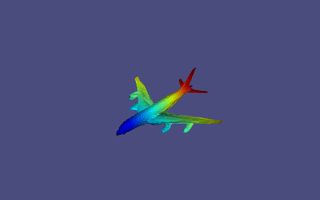
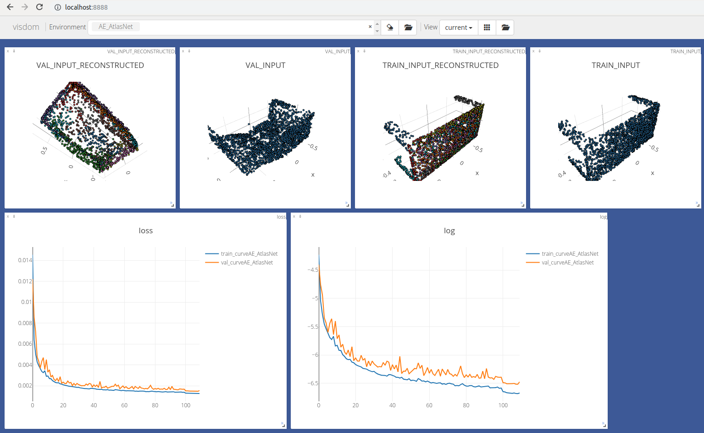

🚀 Major upgrade 🚀 : Migration to  **Pytorch v1** and **Python 3.7**. The code is now much more generic and easy to install. 

# AtlasNet

This repository contains the source codes for the paper [AtlasNet: A Papier-Mâché Approach to Learning 3D Surface Generation ](http://imagine.enpc.fr/~groueixt/atlasnet/). The network is able to synthesize a mesh (point cloud + connectivity) from a low-resolution point cloud, or from an image.
    



### Citing this work

If you find this work useful in your research, please consider citing:

```
@inproceedings{groueix2018,
          title={{AtlasNet: A Papier-M\^ach\'e Approach to Learning 3D Surface Generation}},
          author={Groueix, Thibault and Fisher, Matthew and Kim, Vladimir G. and Russell, Bryan and Aubry, Mathieu},
          booktitle={Proceedings IEEE Conf. on Computer Vision and Pattern Recognition (CVPR)},
          year={2018}
        }
```

### Project Page

The project page is available http://imagine.enpc.fr/~groueixt/atlasnet/

# Install

### Clone the repo and install dependencies

This implementation uses [Pytorch](http://pytorch.org/). 

```shell
## Download the repository
git clone https://github.com/ThibaultGROUEIX/AtlasNet.git
cd AtlasNet
## Create python env with relevant packages
conda create --name pytorch-atlasnet python=3.7
source activate pytorch-atlasnet
pip install pandas visdom
conda install pytorch torchvision -c pytorch # or from sources if you prefer
# you're done ! Congrats :)

```
Tested on 11/18 with  pytorch 0.4.1 (py37_py36_py35_py27__9.0.176_7.1.2_2) and [latest source](https://github.com/pytorch/pytorch/commit/8e3240d022c47e670f7f3f1a379dbf308ea2f28f)
# Demo

Require 3GB RAM on the GPU and 5sec to run. Pass ```--cuda 0``` to run without gpu (9sec). 

```shell
cd trained_models; ./download_models.sh; cd .. # download the trained models
python inference/demo.py --cuda 1
```

    

This script takes as input a 137 * 137 image (from ShapeNet), run it through a trained resnet encoder, then decode it through a trained atlasnet with 25 learned parameterizations, and save the output to output.ply


# Training

### Data 

```shell
cd data; ./download_data.sh; cd ..
```
We used the [ShapeNet](https://www.shapenet.org/) dataset for 3D models, and rendered views from [3D-R2N2](https://github.com/chrischoy/3D-R2N2):

When using the provided data make sure to respect the shapenet [license](https://shapenet.org/terms).

* [The point clouds from ShapeNet, with normals](https://cloud.enpc.fr/s/j2ECcKleA1IKNzk) go in ``` data/customShapeNet```
* [The corresponding normalized mesh (for the metro distance)](https://cloud.enpc.fr/s/RATKsfLQUSu0JWW) go in ``` data/ShapeNetCorev2Normalized```
* [the rendered views](https://cloud.enpc.fr/s/S6TCx1QJzviNHq0) go in ``` data/ShapeNetRendering```

The trained models and some corresponding results are also available online :

* [The trained_models](https://cloud.enpc.fr/s/c27Df7fRNXW2uG3) go in ``` trained_models/```

In case you need the results of ICP on PointSetGen output :
* [ICP on PSG](https://cloud.enpc.fr/s/3a7Xg9RzIsgmofw)


### Build chamfer distance (optional)

Using the custom chamfer distance will *divide memory usage by 2* and will be a bit faster. Use it if you're short on memory especially when training models for **Single View reconstruction**.

```shell
source activate pytorch-atlasnet
cd ./extension
python setup.py install
```


### Start training

* First launch a visdom server :

```bash
python -m visdom.server -p 8888
```

* Launch the training. Check out all the options in ```./training/train_AE_AtlasNet.py``` .

```shell
export CUDA_VISIBLE_DEVICES=0 #whichever you want
source activate pytorch-atlasnet
git pull
env=AE_AtlasNet
nb_primitives=25
python ./training/train_AE_AtlasNet.py --env $env --nb_primitives $nb_primitives |& tee ${env}.txt
```

* Monitor your training on http://localhost:8888/




* Compute some results with your trained model

  ```bash
  python ./inference/run_AE_AtlasNet.py
  ```
  The trained models accessible [here](TODO) have the following performances, slightly better than the one reported in [the paper](TODO). The number reported is the chamfer distance.

| Method | Chamfer⁽⁰⁾ |GPU memory⁽¹⁾ |Time by epoch⁽²⁾|
| ---------- | --------------------- | --------------------- | --------------------- |
| Autoencoder_Atlasnet_25prim | 0.0014476474650672833 | 4.1GB         |6min55s|
| Autoencoder_Atlasnet_1sphere              | 0.0017207141972321953 |3.6GB|5min30s|
| Autoencoder_Baseline                     | 0.001963350556556298 |1.9GB|2min05s|
| SingleViewReconstruction_Atlasnet_25prim  | 0.004638490150569042 |6.8GB|10min04s|
| SingleViewReconstruction_Atlasnet_1sphere | 0.005198702077052366 |5.6GB|8min16s|
| SingleViewReconstruction_Baseline        | 0.0048062904884797605 |1.7GB|3min30s|

⁽⁰⁾  computed between 2500 ground truth points and 2500 reconstructed points.

⁽¹⁾ with the flag ```--accelerated_chamfer 1```.

⁽²⁾this is only an estimate, the code is not optimised.  The easiest way to enhance it would be to preload the training data to use the GPU at 100%. Time computed with the flag ```--accelerated_chamfer 1```.

  #### Autoencoder : 25 learned parameterization

|  val_loss   | watercraft | monitor    | car        | couch      | cabinet    | lamp       | plane      | speaker    | table      | chair      | bench      | firearm    | cellphone  |
| ---- | ---- | ---- | ---- | ---- | ---- | ---- | ---- | ---- | ---- | ---- | ---- | ---- | ---- |
| 0.0014795344685297⁽³⁾ | 0.00127737027906 | 0.0016588120616 | 0.00152693425022 | 0.00171516126198 | 0.00168296881168 | 0.00232362473947 | 0.000833268054194 | 0.0025417242402 | 0.00149979386376 | 0.00156113364435 | 0.00120812499892 | 0.000626943988977 | 0.0012117530635 |

####   Single View Reconstruction : 25 learned parameterization

| val_loss   | watercraft | monitor    | car        | couch      | cabinet    | lamp       | plane      | speaker    | table      | chair      | bench      | firearm    | cellphone  |
| ---- | ---- | ---- | ---- | ---- | ---- | ---- | ---- | ---- | ---- | ---- | ---- | ---- | ---- |
| 0.00400863720389⁽³⁾ | 0.00336707355723 | 0.00456469316226 | 0.00306795421868 | 0.00404269965806 | 0.00355917039209 | 0.0114094304694 | 0.00192791500002 | 0.00780984506137 | 0.00368373458016 | 0.00407004468516 | 0.0030023689528 | 0.00192803189235 | 0.00293665724291 |

⁽³⁾the number is slightly different for above because it comes from legacy code (Atlasnet v1). 

* Evaluate quantitatively the reconstructed meshes : [METRO DISTANCE](https://github.com/RobotLocomotion/meshConverters/tree/master/vcglib/apps/metro)


### Visualisation 

The generated 3D models' surfaces are not oriented. As a consequence, some area will appear dark if you directly visualize the results in [Meshlab](http://www.meshlab.net/). You have to incorporate your own fragment shader in Meshlab, that flip the normals in they are hit by a ray from the wrong side. An exemple is given for the [Phong BRDF](https://en.wikipedia.org/wiki/Phong_reflection_model).

```shell
sudo mv /usr/share/meshlab/shaders/phong.frag /usr/share/meshlab/shaders/phong.frag.bak
sudo cp auxiliary/phong.frag /usr/share/meshlab/shaders/phong.frag #restart Meshlab
```


## Acknowledgement

The code for the Chamfer Loss was adapted from Fei Xia' repo : [PointGan](https://github.com/fxia22/pointGAN). Many thanks to him !

This work was funded by [Adobe System](https://github.com/fxia22/pointGAN) and [Ecole Doctorale MSTIC](http://www.univ-paris-est.fr/fr/-ecole-doctorale-mathematiques-et-stic-mstic-ed-532/).

# Cool Contributions

* **[Yana Hasson](https://github.com/hassony2)** trained our sphere model, for Single View Reconstruction (SVR) in view-centered coordinates : performances are unaffected! Qualitative and quantitative results follow. Many thanks !
View [this paper](http://openaccess.thecvf.com/content_cvpr_2018/CameraReady/3826.pdf) for a good review of on object-centered representation VS view-centered representation.

| frame | Average recontruction error for SVR (x1000) : chamfer distance on input pointcloud and reconstruction of size 2500 pts|
| ---------- | -------------------- |
| object-centered | 4.87⁽⁴⁾ |
| view-centered    | 4.88   |


⁽⁴⁾ Trained with Atlasnet v2 (with learning rate scheduler : slightly better than the paper's result)

## License

[MIT](https://github.com/ThibaultGROUEIX/AtlasNet/blob/master/license_MIT)

## Old links for data
* [The point clouds from ShapeNet, with normals](https://mega.nz/#!9LhW2CxT!A9d45cri4q8q10HfukUV_cy7J1lbWTFQtw7DKJlZKKAhttps://mega.nz/#!9LhW2CxT!A9d45cri4q8q10HfukUV_cy7J1lbWTFQtw7DKJlZKKA) go in ``` data/customShapeNet```
* [The corresponding normalized mesh (for the metro distance)](https://mega.nz/#!leAFEK5T!SDrcll-caO4p8ws7zDNKPpjNNWEMcf9AQ-rmR79t_OA) go in ``` data/ShapeNetCorev2Normalized```
* [the rendered views](https://mega.nz/#!4TgzCYTB!ACfHTD9VpUSUYYwI75k-GrSdqMH19jK0-CwBg1wKH08) go in ``` data/ShapeNetRendering```

The trained models and some corresponding results are also available online :

* [The trained_models](https://mega.nz/#!JapgQRgC!OIAa7dIBaItFSrud3gaGd2Gavb_h_5hC8jHJAwgLNn4) go in ``` trained_models/```


[](https://github.com/ThibaultGROUEIX/AtlasNet/)
