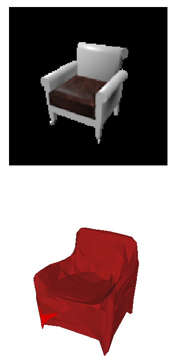
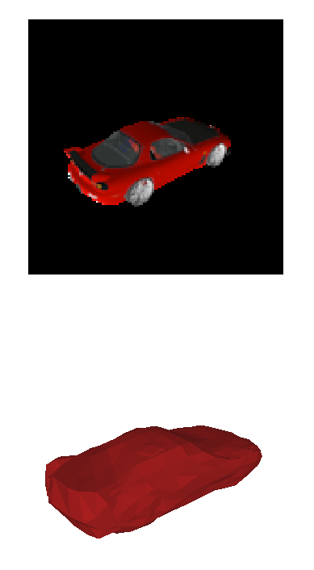

## Cool Contributions

* **[Yana Hasson](https://github.com/hassony2)** trained our sphere model, for Single View Reconstruction (SVR) in view-centered coordinates : performances are unaffected! Qualitative and quantitative results follow. Many thanks !
  View [this paper](http://openaccess.thecvf.com/content_cvpr_2018/CameraReady/3826.pdf) for a good review of on object-centered representation VS view-centered representation.

##### Quantitative Results

| frame           | Average recontruction error for SVR (x1000) : chamfer distance on input pointcloud and reconstruction of size 2500 pts |
| --------------- | ------------------------------------------------------------ |
| object-centered | 4.87⁽⁴⁾                                                      |
| view-centered   | 4.88                                                         |

⁽⁴⁾ Trained with Atlasnet v2 (with learning rate scheduler : slightly better than the paper's result)

