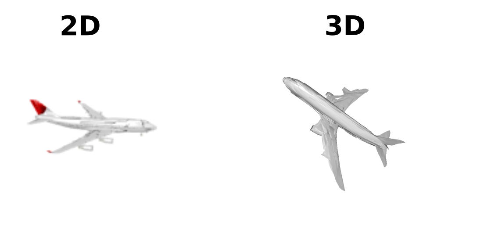

# Demo

```python train.py --demo --demo_input_path YOUR_PATH --reload_model_path YOUR_PATH ```

```
This function takes an image or pointcloud path as input and save the mesh infered by Atlasnet
Extension supported are `ply` `npy` `obg` and `png`
:return: path to the generated mesh
```




### Trained models

All training options can be recovered in `options.txt`

* `./training/trained_models/atlasnet_autoencoder_25_squares/network.pth` [Default]

* `./training/trained_models/atlasnet_autoencoder_1_sphere/network.pth` 

* `./training/trained_models/atlasnet_singleview_25_squares/network.pth` [Default]

* `./training/trained_models/atlasnet_singleview_1_sphere/network.pth` 

  


Even if you don't own a GPU, the demo can run on  CPU. 


You can use our  [Meshlab Visualization Trick](./doc/meshlab.md) to have nicer visualization of the generated mesh in Meshlab.