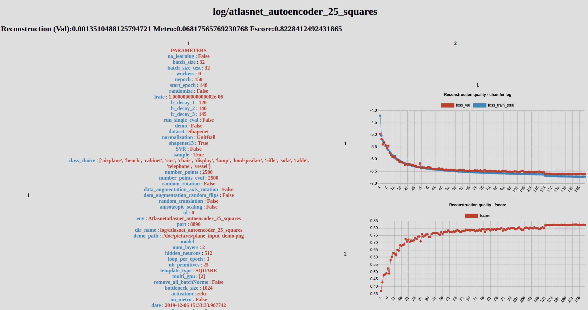

# Training

```shell
python train.py --shapenet13 --dir_name log/atlasnet_autoencoder_25_squares --nb_primitives 25 --template_type SQUARE" # Autoencoder

python train.py --shapenet13 --dir_name log/atlasnet_singleview_25_squares_tmp  --nb_primitives 25 --template_type SQUARE  --SVR  --reload_decoder_path log/atlasnet_autoencoder_25_squares --train_only_encoder #Single-View Reconstruction
```


:raised_hand_with_fingers_splayed: Monitor your training on http://localhost:8890/

:raised_hand_with_fingers_splayed: See report on a completed training at http://localhost:8891/{DIR_NAME}





## Options

```shell
# Training parameters
--no_learning, action="store_true", help="Learning mode (batchnorms...)"
--train_only_encoder, action="store_true", help="only train the encoder"
--batch_size, type=int, default=32, help="input batch size"
--batch_size_test, type=int, default=32, help="input batch size"
--workers, type=int, help="number of data loading workers', default=0)"
--nepoch, type=int, default=150, help="number of epochs to train for"
--start_epoch, type=int, default=0, help="number of epochs to train for"
--randomize, action="store_true", help="Fix random seed or not"
--lrate, type=float, default=0.001, help="learning rate"
--lr_decay_1, type=int, default=120, help="learning rate decay 1"
--lr_decay_2, type=int, default=140, help="learning rate decay 2"
--lr_decay_3, type=int, default=145, help="learning rate decay 2"
--run_single_eval, action="store_true", help="evaluate a trained network"
--demo, action="store_true", help="run demo autoencoder or single-view"
--multi_gpu, nargs='+', type=int, default=[0], help="use multiple gpus'"
--loop_per_epoch, type=int, default=1, help="number of data loop per epoch"


# Data
--shapenet13, action="store_true", help="Load 13 usual shapenet categories"
--SVR, action="store_true", help="Single_view Reconstruction"
--sample, action="store_false", help="Sample the input pointclouds"
--class_choice, nargs='+', default=["airplane"], type=str)
--number_points, type=int, default=2500, help="Number of point sampled on the object"
--random_rotation, action="store_true", help="apply data augmentation : random rotation"
--demo, action="store_true", help="run demo autoencoder or single-view"
--normalization, type=str, default="UnitBall",
                    choices=['UnitBall', 'BoundingBox', 'Identity'])
--number_points_eval, type=int, default=2500,
                    help="Number of point sampled on the object during evaluation"
--data_augmentation_axis_rotation, action="store_true",
                    help="apply data augmentation : axial rotation "
--data_augmentation_random_flips, action="store_true",
                    help="apply data augmentation : random flips"
--random_translation, action="store_true",
                    help="apply data augmentation :  random translation "
--anisotropic_scaling, action="store_true",
                    help="apply data augmentation : anisotropic scaling"

# Save dirs and reload
--id, type=str, default="0", help="training name"
--env, type=str, default="Atlasnet", help="visdom environment"
--visdom_port, type=int, default=8890, help="visdom port"
--http_port, type=int, default=8891, help="http port"
--dir_name, type=str, default="", help="Name of the log folder."
--demo_input_path, type=str, default="./doc/pictures/plane_input_demo.png", help="input test path"


# Network
--num_layers, type=int, default=2, help="number of hidden MLP Layer"
--hidden_neurons, type=int, default=512, help="number of neurons in each hidden layer"
--nb_primitives, type=int, default=1, help="number of primitives"
--remove_all_batchNorms, action="store_true", help="Replace all batchnorms by identity"
--bottleneck_size, type=int, default=1024, help="dim_out_patch"
--activation, type=str, default='relu',
                    choices=["relu", "sigmoid", "softplus", "logsigmoid", "softsign", 											"tanh"], help="dim_out_patch"
--template_type, type=str, default="SQUARE", choices=["SPHERE", "SQUARE"],
                    help="dim_out_patch"
--reload_model_path, type=str, help='reload model path", 		    	default="./training/trained_models/atlasnet_AE_25_patches.pth"
--reload_decoder_path, type=str, help='reload decoder path', default="./training/trained_models/atlasnet_AE_25_patches.pth"

# Loss
--no_metro, action="store_true", help="Skip metro distance"

```


## Quantitative Results 


The number reported are the chamfer distance, the f-score and the [metro](https://github.com/ThibaultGROUEIX/AtlasNet/issues/34) distance.


| Method                 | Chamfer⁽⁰⁾ | Fscore | Metro | Total Train time (min) |
| ---------------------- | ---- | --- -   | ----- |-------     |
| Autoencoder 25 Squares | 1.35 | 82.3%   | 6.82  | 731       |
| Autoencoder 1 Sphere   | 1.35 | 83.3%   | 6.94  | 548    |
| SingleView 25  Squares | 3.78 | 63.1% | 8.94 | 1422      |
| SingleView 1 Sphere    | 3.76 | 64.4% |  9.01  | 1297      |

⁽⁰⁾  computed between 2500 ground truth points and 2500 reconstructed points. x1000

⁽1⁾  Metro is ran on unormalized point clouds (which explains a difference with Atlasnet numbers) x100


# Paper reproduction 

To reproduce main results from the paper : ```python ./training/launcher.py --mode train```

In case you need the results of ICP on PointSetGen output :

* [ICP on PSG](https://cloud.enpc.fr/s/3a7Xg9RzIsgmofw)

